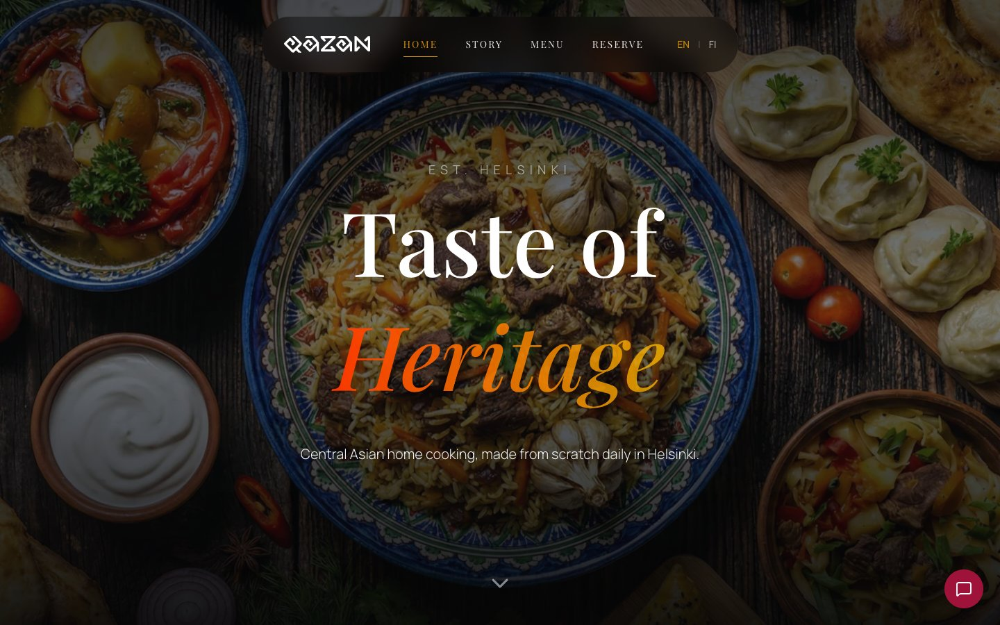
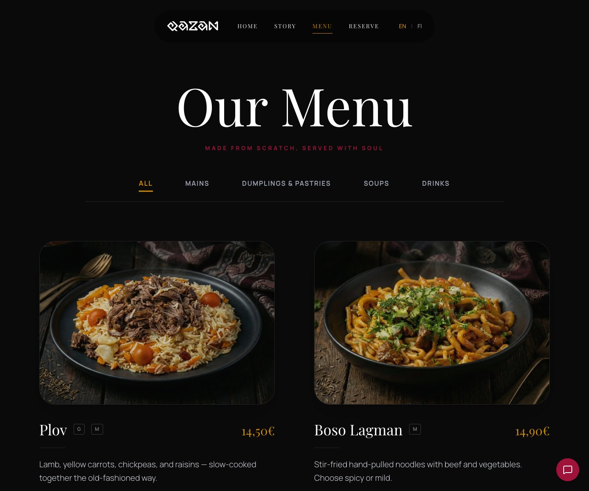
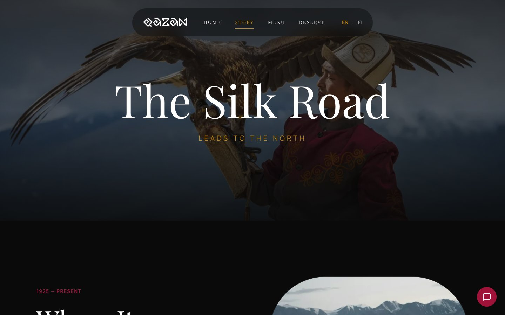
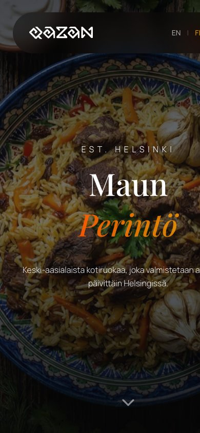

<a id="readme-top"></a>

<!-- PROJECT SHIELDS -->
[![CI][ci-shield]][ci-url]
[![Live][live-shield]][live-url]
[![Stack][stack-shield]](#built-with)

<!-- PROJECT LOGO -->
<br />
<div align="center">
  <a href="https://qazan.fi">
    <picture>
      <source media="(prefers-color-scheme: dark)" srcset="docs/logo-light-on-dark.svg">
      
    </picture>
  </a>

  <h3 align="center">QAZAN Restaurant Website</h3>

  <p align="center">
    The website of QAZAN, a Central Asian restaurant in Itäkeskus, Helsinki: menu, story, table
    reservations and delivery, in English and Finnish.
    <br />
    A static React single-page app, built and shipped by two friends.
    <br />
    <br />
    <a href="https://qazan.fi"><strong>Open the live site »</strong></a>
    <br />
    <br />
    <a href="#screenshots">Screenshots</a>
    &middot;
    <a href="#getting-started">Run it locally</a>
    &middot;
    <a href="#project-story">Project story</a>
    &middot;
    <a href="#team">Team</a>
  </p>
</div>

<!-- TABLE OF CONTENTS -->
<details>
  <summary>Table of Contents</summary>
  <ol>
    <li>
      <a href="#about-the-project">About The Project</a>
      <ul>
        <li><a href="#screenshots">Screenshots</a></li>
        <li><a href="#pages">Pages</a></li>
        <li><a href="#how-it-is-built">How It Is Built</a></li>
        <li><a href="#repository-layout">Repository Layout</a></li>
        <li><a href="#built-with">Built With</a></li>
      </ul>
    </li>
    <li><a href="#getting-started">Getting Started</a></li>
    <li><a href="#deployment">Deployment</a></li>
    <li><a href="#editing-the-content">Editing the Content</a></li>
    <li><a href="#project-story">Project Story</a></li>
    <li><a href="#status">Status</a></li>
    <li><a href="#team">Team</a></li>
    <li><a href="#content-and-license">Content and License</a></li>
    <li><a href="#contact">Contact</a></li>
    <li><a href="#acknowledgments">Acknowledgments</a></li>
  </ol>
</details>

<!-- ABOUT THE PROJECT -->
## About The Project

[QAZAN](https://qazan.fi) is a family-run restaurant in Itäkeskus, Helsinki, serving Central Asian home
cooking: hand-pulled lagman, plov cooked in a cast-iron kazan, steamed manty, samsa and shurpa. The owners
needed a website that does what a restaurant site has to do, and does it well on a phone:

* **Show the food.** Every dish has its own photo and a detail view with ingredients, taste notes and
  serving suggestions. Teas and sodas open a small carousel of variants.
* **Take a booking.** The reservation button hands the guest over to the restaurant's booking system
  ([Tebi](https://tebi.co)); the site itself stores nothing.
* **Sell delivery.** Wolt links in the footer and in the on-page concierge widget.
* **Speak both languages.** The whole interface, the menu and the story are available in English and
  Finnish. The language comes from the `?lang=` parameter, then the visitor's last choice, then the browser.
* **Be found.** Open Graph and Twitter cards, `Restaurant` structured data with the full menu, sitemap,
  `hreflang` alternates, real URLs (`/menu`, `/story`) instead of hash routes.

The design is dark and editorial: Playfair Display for headings, Manrope for text, a ruby and gold accent
palette, and scroll-driven motion that stays out of the way on mobile.

<p align="right">(<a href="#readme-top">back to top</a>)</p>

### Screenshots

Captured from the local production build at 1440 px wide, plus one phone view (Finnish).

| Home | Menu |
|---|---|
|  |  |

| Story | Home, 390 px |
|---|---|
|  |  |

<p align="right">(<a href="#readme-top">back to top</a>)</p>

### Pages

| Route | What is on it |
|---|---|
| `/` | Full-screen hero with parallax, the concept, a carousel of signature dishes, the team, three Google reviews, and the reservation call to action |
| `/menu` | The full menu by category (mains, dumplings and pastries, soups, drinks). Every card opens a modal with ingredients, taste and pairing notes; teas and sodas page through their variants |
| `/story` | Where the family comes from, what changed in Helsinki, and the three values behind the kitchen |
| anything else | A bilingual 404 page that sends crawlers a `noindex` and guests back home |

On every page: a floating navbar that shrinks on scroll and turns into a full-screen drawer on phones, the
"QAZAN Concierge" widget (book, order, FAQ, contact), and a footer with address, hours and social links.

<p align="right">(<a href="#readme-top">back to top</a>)</p>

### How It Is Built

```
 browser
    │
 index.html    meta tags, Open Graph, JSON-LD (Restaurant + Menu), favicons, Tebi widget
    │
 src/main.tsx  self-hosted fonts + src/index.css (Tailwind v4 theme tokens)
    │
 src/App.tsx   <BrowserRouter> · language detection · lazy routes
    ├─ components/Navbar     desktop links, phone drawer, EN/FI switch, "Reserve" scroll handler
    ├─ pages/Home            Hero → About → MenuCarousel → Team → Reviews → Reservation
    ├─ pages/Menu            MenuHeader (category tabs) → MenuGrid → MenuItemModal (portal)
    ├─ pages/Story           StoryHero → Roots → Fusion → Values
    ├─ pages/NotFound
    ├─ components/ChatBot    the concierge widget
    └─ components/Footer
 src/constants.ts  every string on the site: translations, menu, dish details, tea and soda
                   variants, reviews, contact details, external links, opening hours
```

* **Content is data.** Both languages, the whole menu, the dish details and the contact information live in
  [`src/constants.ts`](src/constants.ts), typed by [`src/types.ts`](src/types.ts). Changing a price or
  adding a dish never touches a component, and TypeScript refuses a translation key that is missing in one
  language.
* **Pages own their sections.** A section used by one page lives in that page's folder. Shared pieces are
  deliberately few: `Navbar`, `Footer`, `ChatBot`, `Reveal` (the scroll-in animation wrapper) and
  `SignatureSVG`.
* **One theme.** Colours and font families are Tailwind v4 `@theme` tokens in
  [`src/index.css`](src/index.css); components reference `qazan-ruby`, `qazan-gold`, `font-serif` and
  nothing else.
* **Fast by default.** The Menu, Story and ChatBot chunks load on demand; React, Framer Motion and the icon
  set are split into their own long-cached vendor chunks; fonts are self-hosted (no request to Google);
  the hero image is preloaded with `fetchpriority="high"`; every image below the fold is lazy and carries
  its dimensions; `vite-plugin-image-optimizer` recompresses everything at build time.
* **Static by design.** No server, no database. `vite build` produces a folder that any host can serve;
  [`nginx.conf`](nginx.conf) and [`public/_redirects`](public/_redirects) both map deep links to
  `index.html` so `/menu` works when opened directly.
* **No secrets, no environment.** Nothing is needed to build or run the site. The Tebi widget token and the
  reservation link are public identifiers of the restaurant.

<p align="right">(<a href="#readme-top">back to top</a>)</p>

### Repository Layout

```
QazanRestaurant/
├─ index.html                    entry: SEO meta, structured data, favicons, Tebi widget
├─ vite.config.ts                React + Tailwind plugins, image optimizer, vendor chunks
├─ tsconfig.json                 strict TypeScript
├─ eslint.config.js              ESLint 10 + typescript-eslint + react-hooks
├─ src/
│  ├─ main.tsx                   fonts, global CSS, React root
│  ├─ App.tsx                    router, language state, lazy routes
│  ├─ index.css                  Tailwind import and theme tokens
│  ├─ constants.ts               translations, menu, details, reviews, contact, links, hours
│  ├─ types.ts                   Language, MenuItem, Translations, …
│  ├─ components/                Navbar, Footer, ChatBot, Reveal
│  └─ pages/
│     ├─ Home/components/        HeroSection, AboutSection, MenuCarousel, TeamSection, ReviewsSection, ReservationSection, SignatureSVG
│     ├─ Menu/components/        MenuHeader, MenuGrid, MenuItemModal
│     ├─ Story/components/       StoryHero, RootsSection, FusionSection, ValuesSection
│     └─ NotFound.tsx
├─ public/
│  ├─ images/                    photos of the food, the team and the restaurant; logo
│  ├─ images/menu/               one photo per dish and drink
│  ├─ og-image.jpg               link preview image
│  ├─ robots.txt, sitemap.xml, site.webmanifest, favicons
│  └─ _redirects                 SPA fallback for Netlify / Cloudflare Pages
├─ docs/screenshots/             the images in this README
├─ Dockerfile, docker-compose.yml, nginx.conf   container deployment
└─ .github/workflows/ci.yml      typecheck, lint and build on every push
```

<p align="right">(<a href="#readme-top">back to top</a>)</p>

### Built With

* [![React][React-badge]][React-url]
* [![TypeScript][TypeScript-badge]][TypeScript-url]
* [![Vite][Vite-badge]][Vite-url]
* [![Tailwind CSS][Tailwind-badge]][Tailwind-url]
* [![Framer Motion][Framer-badge]][Framer-url]
* [![React Router][ReactRouter-badge]][ReactRouter-url]
* [![Docker][Docker-badge]][Docker-url]
* [![Nginx][Nginx-badge]][Nginx-url]
* [![GitHub Actions][Actions-badge]][Actions-url]

Icons are [Lucide](https://lucide.dev). Fonts are
[Playfair Display](https://fonts.google.com/specimen/Playfair+Display) and
[Manrope](https://fonts.google.com/specimen/Manrope), bundled from [Fontsource](https://fontsource.org).

<p align="right">(<a href="#readme-top">back to top</a>)</p>

<!-- GETTING STARTED -->
## Getting Started

Requires Node.js 20.19+ (22 recommended) and npm. No environment variables, no accounts.

```sh
git clone https://github.com/alekseiTikhonovWeb/QazanRestaurant.git
cd QazanRestaurant
npm ci
npm run dev        # http://localhost:3000
```

```sh
npm run build      # production bundle in dist/
npm run preview    # serve dist/ locally
npm run check      # typecheck + lint + build, the same steps CI runs
```

<p align="right">(<a href="#readme-top">back to top</a>)</p>

<!-- DEPLOYMENT -->
## Deployment

The output of `npm run build` is a static folder. Three ways to host it:

| Target | How |
|---|---|
| Static hosting (how qazan.fi runs today) | Upload the contents of `dist/` to the web root. The host must serve `index.html` for unknown paths; on Apache or LiteSpeed that is a short `.htaccess` rewrite rule |
| Netlify, Cloudflare Pages | Point the project at the repository; `public/_redirects` handles deep links |
| Any VPS | `docker compose up -d --build` builds the site and serves it with nginx on port 80, with gzip, long cache headers for hashed assets and the SPA fallback from [`nginx.conf`](nginx.conf) |

<p align="right">(<a href="#readme-top">back to top</a>)</p>

<!-- EDITING THE CONTENT -->
## Editing the Content

Everything a restaurant changes lives in one file, [`src/constants.ts`](src/constants.ts):

| To change | Edit |
|---|---|
| A price, a dish, a description | `MENU_ITEMS` (once per language) and `DISH_DETAILS` for the modal text |
| Teas or sodas | `TEA_VARIANTS`, `SODA_VARIANTS` |
| Address, phone, e-mail | `CONTACT` |
| Booking, Wolt, Instagram, TikTok links | `LINKS` |
| Opening hours | `OPENING_HOURS`, then the same hours in `index.html` (JSON-LD and the `<noscript>` block) |
| Any interface text | `TRANSLATIONS.en` and `TRANSLATIONS.fi` |

Photos go in `public/images/` (WebP, about 1200 px wide is plenty; the build compresses them again).

<p align="right">(<a href="#readme-top">back to top</a>)</p>

<!-- PROJECT STORY -->
## Project Story

| When | What happened |
|---|---|
| Feb 2026 | First prototype of the concept, deployed to test the design direction |
| Feb 2026 | Restructured: one folder per page, typed translations, Framer Motion animations, the hero and header behaviour, the reservation section |
| Mar 2026 | Real content from the restaurant: the menu with photos of every dish, the team, Google reviews, the story pages. Clean URLs, SEO and structured data, favicons, code splitting, image optimisation. Site goes live at qazan.fi |
| After launch | Reservations moved to Tebi, the restaurant's booking and ordering system |
| Sep 2026 | Repository audit: strict TypeScript and ESLint with CI, self-hosted fonts, a 404 page, language detection from the URL and the browser, dead code and 12 MB of unused images removed, all contact details and links moved into one place, this README |

<p align="right">(<a href="#readme-top">back to top</a>)</p>

<!-- STATUS -->
## Status

The site is live and in daily use. What is done, and what could come next:

- [x] Three pages, bilingual, responsive, with mobile navigation
- [x] Menu with per-dish details and photo carousels for drinks
- [x] Reservations through Tebi, delivery through Wolt
- [x] SEO: meta tags, Open Graph, JSON-LD with the menu, sitemap, hreflang
- [x] Typecheck, lint and build in CI
- [ ] Lunch menu and seasonal specials as their own sections
- [ ] A small CMS or a JSON file for the menu, so the owners can edit prices without a developer
- [ ] Photo gallery of the restaurant
- [ ] Privacy-friendly analytics

<p align="right">(<a href="#readme-top">back to top</a>)</p>

<!-- TEAM -->
## Team

Two friends, working directly with the restaurant's owners. The project started from Ildar's first
prototype; most of the site as it stands today is Aleksei's work.

| | Focus |
|---|---|
| [@alekseiTikhonovWeb](https://github.com/alekseiTikhonovWeb) | Design and front-end: the pages, components and animations, all photography (generated and sourced), about half of the copy, SEO and performance, deployment, this repository |
| [@DarikCode](https://github.com/DarikCode) (Ildar Mamin) | Project kickoff and the first prototype, part of the copy and content |

<p align="right">(<a href="#readme-top">back to top</a>)</p>

<!-- CONTENT AND LICENSE -->
## Content and License

The texts, the logo, the photographs and the menu in `public/` and `src/constants.ts` belong to QAZAN
Restaurant and appear here only so that the site can be seen as it runs. They are not licensed for reuse.

The code has no license. This is a portfolio project: it is shared to be read and discussed, not to be
reused. If you want to use any part of it, ask.

<p align="right">(<a href="#readme-top">back to top</a>)</p>

<!-- CONTACT -->
## Contact

Aleksei Tikhonov · [@alekseiTikhonovWeb](https://github.com/alekseiTikhonovWeb) · support@wasd.digital

Project: [https://github.com/alekseiTikhonovWeb/QazanRestaurant](https://github.com/alekseiTikhonovWeb/QazanRestaurant)
· Site: [https://qazan.fi](https://qazan.fi)

<p align="right">(<a href="#readme-top">back to top</a>)</p>

<!-- ACKNOWLEDGMENTS -->
## Acknowledgments

* The QAZAN family, for the food, the photos and the trust
* [Tebi](https://tebi.co) and [Wolt](https://wolt.com), which handle bookings and delivery so the site does not have to
* [Fontsource](https://fontsource.org) and [Lucide](https://lucide.dev)
* [Best-README-Template](https://github.com/othneildrew/Best-README-Template)

<p align="right">(<a href="#readme-top">back to top</a>)</p>

<!-- MARKDOWN LINKS & IMAGES -->
[ci-shield]: https://github.com/alekseiTikhonovWeb/QazanRestaurant/actions/workflows/ci.yml/badge.svg
[ci-url]: https://github.com/alekseiTikhonovWeb/QazanRestaurant/actions/workflows/ci.yml
[live-shield]: https://img.shields.io/badge/live-qazan.fi-9f1239?style=flat-square
[live-url]: https://qazan.fi
[stack-shield]: https://img.shields.io/badge/stack-React%2019%20%C2%B7%20Vite%206%20%C2%B7%20Tailwind%204-ca8a04?style=flat-square
[React-badge]: https://img.shields.io/badge/React-20232A?style=for-the-badge&logo=react&logoColor=61DAFB
[React-url]: https://react.dev/
[TypeScript-badge]: https://img.shields.io/badge/TypeScript-3178C6?style=for-the-badge&logo=typescript&logoColor=white
[TypeScript-url]: https://www.typescriptlang.org/
[Vite-badge]: https://img.shields.io/badge/Vite-646CFF?style=for-the-badge&logo=vite&logoColor=white
[Vite-url]: https://vite.dev/
[Tailwind-badge]: https://img.shields.io/badge/Tailwind_CSS-06B6D4?style=for-the-badge&logo=tailwindcss&logoColor=white
[Tailwind-url]: https://tailwindcss.com/
[Framer-badge]: https://img.shields.io/badge/Framer_Motion-0055FF?style=for-the-badge&logo=framer&logoColor=white
[Framer-url]: https://motion.dev/
[ReactRouter-badge]: https://img.shields.io/badge/React_Router-CA4245?style=for-the-badge&logo=reactrouter&logoColor=white
[ReactRouter-url]: https://reactrouter.com/
[Docker-badge]: https://img.shields.io/badge/Docker-2496ED?style=for-the-badge&logo=docker&logoColor=white
[Docker-url]: https://www.docker.com/
[Nginx-badge]: https://img.shields.io/badge/Nginx-009639?style=for-the-badge&logo=nginx&logoColor=white
[Nginx-url]: https://nginx.org/
[Actions-badge]: https://img.shields.io/badge/GitHub_Actions-2088FF?style=for-the-badge&logo=githubactions&logoColor=white
[Actions-url]: https://github.com/features/actions
